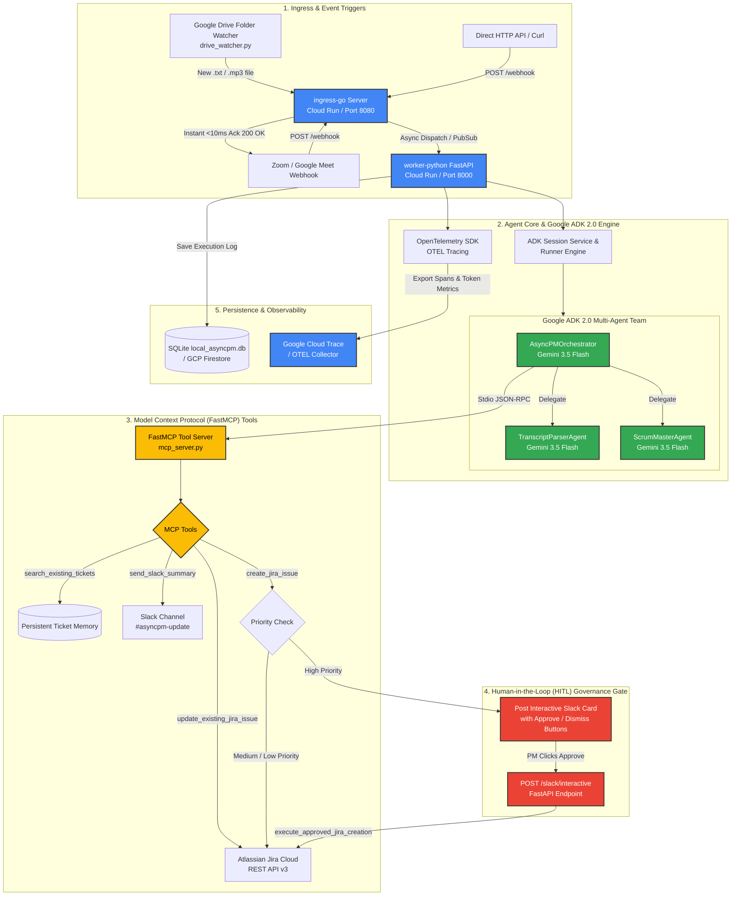

# 🚀 AsyncPM — Autonomous Product Manager Agent

> Built for the **All Things Agentic Hackathon** (Taskmaster Track)  
> Powered by **Google ADK 2.0**, **Gemini 3.5 Flash**, **MCP (Model Context Protocol)**, and **Google Cloud**.

AsyncPM is an autonomous background AI agent that eliminates administrative product management overhead. It turns unstructured meeting transcripts and audio recordings into formalized Agile User Stories, creates Jira tickets, and broadcasts summaries to Slack—operating silently with zero manual intervention.

---

## 🏗️ Technical Architecture

* **Agent Framework:** Google Agent Development Kit (ADK 2.0) + Google GenAI SDK
* **LLM Engine:** Gemini 3.5 Flash (Native Multimodal Text & Audio Processing)
* **Tool Protocol:** Model Context Protocol (FastMCP Stdio Toolset)
* **Ingress Engine:** Golang (Ultra-fast, sub-10ms event-driven webhook receiver)
* **Agent Backend:** Python FastAPI + ADK 2.0 Runner (`InMemorySessionService`)
* **State & Memory:** Local SQLite Audit DB (`local_asyncpm.db`) — *Mappable to Cloud Firestore on GCP*
* **Storage & Sync:** Google Drive API v3 Watcher — *Mappable to Cloud Storage on GCP*
* **Observability:** OpenTelemetry (OTEL) SDK — *Mappable to Google Cloud Trace on GCP*
* **Integrations:** Atlassian Jira Cloud REST API v3 + Slack Block Kit Interactive API
* **DevOps & Infrastructure:** Docker Compose, Makefile, GitHub Actions CI/CD (`.github/workflows/ci.yml`), Google Cloud Run

## 📐 System Architecture Diagram


---

## 🛠️ Local Setup & Spin-Up Instructions

### Prerequisites
* **Python:** 3.11+
* **Golang:** 1.22+
* **Docker & Docker Compose:** Installed and running
* **Gemini API Key:** Free key from [Google AI Studio](https://aistudio.google.com/)
* **Atlassian Jira Cloud:** Free developer account
* **Slack Workspace:** Incoming Webhook enabled

---

### 1. Environment Configuration

Create a file named `worker-python/.env`:

```env
# Gemini API Key (Required - From AI Studio)
GEMINI_API_KEY=your_gemini_api_key_here

# Atlassian Jira Cloud Integration
JIRA_DOMAIN=your-domain.atlassian.net
JIRA_EMAIL=your-email@example.com
JIRA_API_TOKEN=your_jira_api_token
JIRA_PROJECT_KEY=SCRUM

# Slack Integration
SLACK_WEBHOOK_URL=https://hooks.slack.com/services/T0000/B0000/XXXXX

# Google Drive Folder Watcher (Optional)
GOOGLE_DRIVE_FOLDER_ID=your_drive_folder_id
```

### 2. How to Run the Application
**Option A: Docker Compose (Recommended - 1 Command)**
Build and run the full microservice stack inside isolated containers:

```
# Build and start all services (ingress-go + worker-python)
make docker-up

# Stop all containers when finished
make docker-down
```

**Option B: Local CLI Development via Makefile**
Run services locally outside Docker:

```
# Terminal 1: Start Python ADK Worker (Port 8000)
make dev-python

# Terminal 2: Start Golang Ingress Server (Port 8080)
make dev-go

# Terminal 3 (Optional): Start Google Drive Watcher Service
make drive-watcher
```

## 🧪 Reproducible Testing Scenarios
**Scenario 1: Text Transcript Processing**
Send a text transcript to the Golang Ingress endpoint (http://localhost:8080/webhook):

```
make test-transcript
```

- **What Happens:** ingress-go acknowledges in <10ms and forwards payload asynchronously to worker-python. Google ADK 2.0 invokes AsyncPMOrchestrator, delegates to TranscriptParserAgent and ScrumMasterAgent, formats user stories, and triggers Jira/Slack tools.

**Scenario 2: Native Multimodal Audio Processing**
Send a raw .mp3 or .m4a meeting audio file directly to Gemini 3.5 Flash:

```
make test-audio
```

- **What Happens:** Gemini 3.5 Flash listens directly to raw audio bytes, extracts technical tasks, and creates Jira tickets without requiring third-party transcription tools.

**Scenario 3: Human-in-the-Loop (HITL) Governance Gate**
Send a High-Priority or security-critical meeting transcript:

```
curl -X POST "http://localhost:8080/webhook" \
     -H "Content-Type: application/json" \
     -d '{
       "meeting_id": "MEET-SECURITY-001",
       "source": "google_meet",
       "transcript": "Dave: URGENT ALARM. Firewall rules were wiped. Sarah, please restore Cloud Firewall rules immediately."
     }'
```

- **What Happens:**
1. AsyncPM detects Priority: High and halts automatic Jira ticket creation.
2. Posts an interactive Slack Block Kit Card with **[ ✅ Approve & Create Jira Ticket ]** and **[ ❌ Dismiss ]** buttons.
3. Click **Approve** in Slack → Slack sends callback to /slack/interactive → AsyncPM creates ticket SCRUM-11 live on Jira and updates Slack in-place!

**Scenario 4: Cross-Meeting Persistent Memory & Deduplication**
Send a transcript mentioning a topic discussed in a previous meeting (e.g., "Redis caching"):

- **What Happens:** AsyncPM calls the MCP tool search_existing_tickets, searches local_asyncpm.db memory, identifies the matching prior ticket, and calls update_existing_jira_issue to append comments instead of creating a duplicate ticket!

**Scenario 5: Google Drive Auto-Sync Trigger**
1. Start the drive watcher: *make drive-watcher*.
2. Drag and drop any .txt or .mp3 transcript into your designated Google Drive folder.
- **What Happens:** *drive_watcher.py* detects the new file within 5 seconds, downloads it, and routes it to AsyncPM automatically!

## 🔭 OpenTelemetry Tracing & Observability
AsyncPM includes built-in OpenTelemetry instrumentation (worker-python/telemetry.py).
During execution, structured spans are emitted to console logs tracking:
- POST /process-transcript (HTTP Server Span)
- run_adk_agent_pipeline (Parent Span)
- transfer_to_agent → TranscriptParserAgent (Agent Delegation Span)
- execute_tool create_jira_issue (MCP Tool Execution Span)
- Token consumption metrics (gen_ai.usage.input_tokens, gen_ai.usage.output_tokens)

*When deployed to Google Cloud Run, these spans render automatically as visual flame graphs in **Google Cloud Trace.***

## ☁️ Google Cloud Run Deployment Commands
Deploy both microservices to Google Cloud Run:

```
# 1. Deploy Python ADK Worker
make deploy-worker

# 2. Deploy Golang Ingress Server
make deploy-ingress

# Or deploy both simultaneously
make deploy-all

# Stream live Cloud Run execution logs
make logs-worker
```